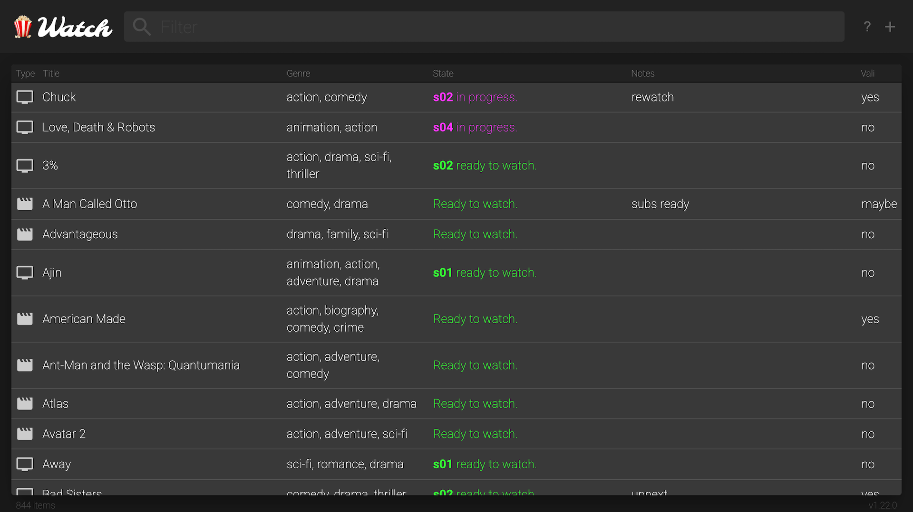
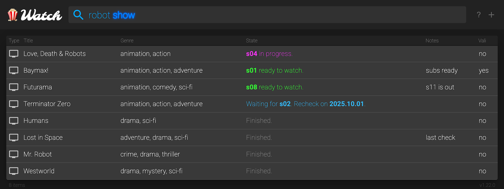
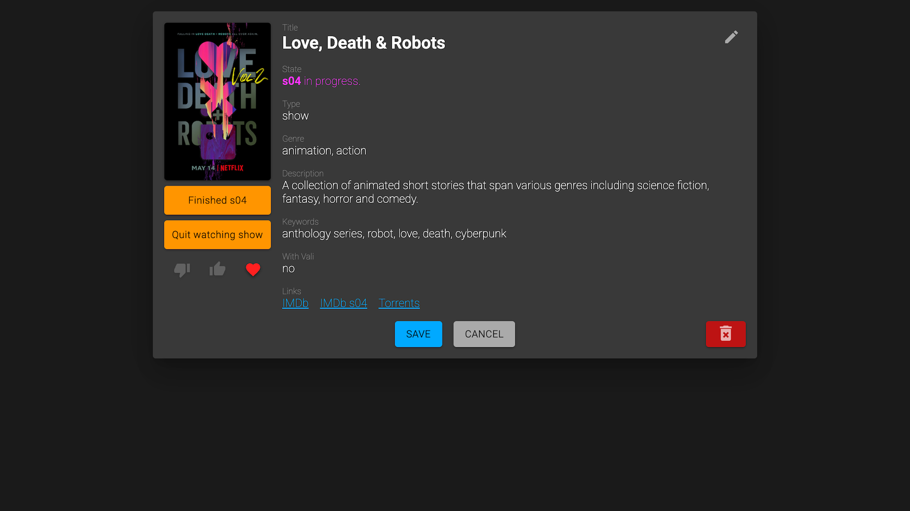
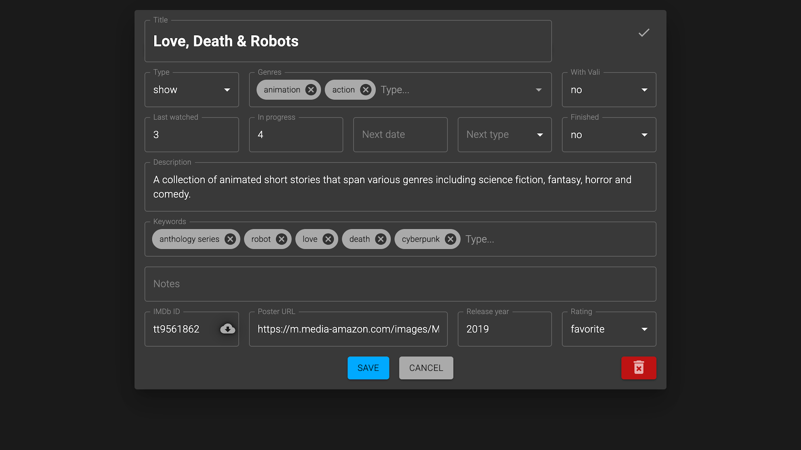

# Watch

This is an app I made to store and manage the list of movies and TV shows I'm interested in. I used
to keep this data in a big Google Sheet, but it required way too much manual work, and searching
and filtering was very tedious. There are existing solutions for this, but I wanted a UX tailored
exactly to my own needs.

## Main Features

- Adding movies and shows by filling a form.
- Adding movies and shows by just pasting an IMDb ID. All details auto-filled.
- Keeping track of the states: waiting for next season, ready to watch, in progress, etc.
  Transition between states with a single click.
- Simple but powerful search. Multiple words, keywords, commands.
  For example "show" searches for TV shows, not anything with the word "show" in it.
- Poster image search (based on Google image search).
- External links to IMDb, torrent search, subtitles search, trailers/recaps on YouTube, etc.
- Keyboard shortcuts and navigation.
- Mobile support.
- Automatic daily backups.

## Screenshots

- Home   
- Search   
- Details   
- Form   

## Tech Stack

- Database: MongoDB.
- Server: Node.js, Express.
- Client: React SPA, Material UI, Valtio.

## Notes and Disclaimers

- This is a very old project. I recently (2025) modernized it a fair bit, but still.
- Locally hosted for my own usage. There are no features like authentication or multiple profiles.
- Single repo, but not a monorepo. I'd use yarn or bun workspaces today.
- No TypeScript. I'd definitely use TypeScript today.
- No unit tests. I'd probably add tests today, that would be quite useful for AI agents.
- Only tested on the latest Chrome, Safari and Mobile Safari.

## Usage

- Clone the repo.
- Install [MongoDB](https://www.mongodb.com/) if you don't already have.
- Run `nvm use 22`.
- Run `npm install`.
- Then `npm run start-all` for development mode.

## Scripts

- To start in development mode:
  1. Start Mongo DB: `npm run mongo`
  2. Start server: `npm run server`
  3. Start client: `npm start`
- To start all at once in development mode: `npm run start-all`
- To make a production build: `npm run build`
- To start the production build: `npm run start-all-prod`
